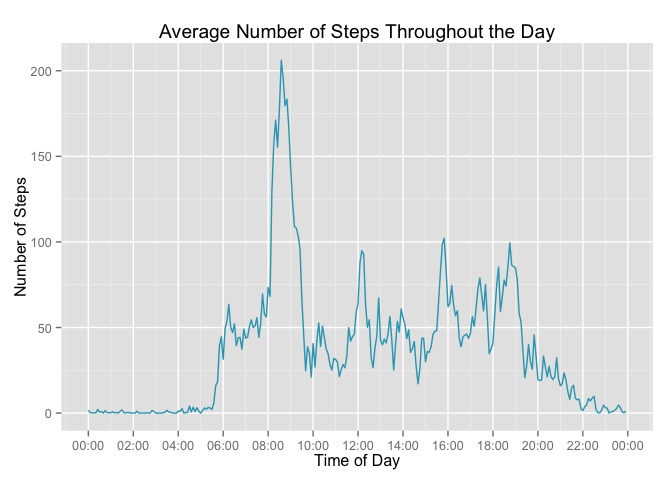

# Reproducible Research: Peer Assessment 1
## Loading and preprocessing the data

```r
library('dplyr')
```

```
## 
## Attaching package: 'dplyr'
## 
## The following object is masked from 'package:stats':
## 
##     filter
## 
## The following objects are masked from 'package:base':
## 
##     intersect, setdiff, setequal, union
```

```r
library('ggplot2')
library('scales')
library('stringr')

setwd('~/git/data-science/RepData_PeerAssessment1/')

data <- read.csv('activity.csv', as.is = TRUE)
data$date <- as.POSIXct(data$date)
```

## What is mean total number of steps taken per day?

*1. Calculate the total number of steps taken per day*

```r
total_steps_per_day <- data %>%
  na.omit() %>%
  group_by(date) %>%
  summarize(steps = sum(steps))

print(total_steps_per_day)
```

```
## Source: local data frame [53 x 2]
## 
##          date steps
## 1  2012-10-02   126
## 2  2012-10-03 11352
## 3  2012-10-04 12116
## 4  2012-10-05 13294
## 5  2012-10-06 15420
## 6  2012-10-07 11015
## 7  2012-10-09 12811
## 8  2012-10-10  9900
## 9  2012-10-11 10304
## 10 2012-10-12 17382
## ..        ...   ...
```

*2. Make a histogram of the total number of steps taken each day*

```r
hist(total_steps_per_day$steps)
```

 

*3. Calculate and report the mean and median of the total number of steps taken per day*

```r
total_steps_per_day %>%
  summarize(mean_steps_per_day = mean(steps),
            median_steps_per_day = median(steps))
```

```
## Source: local data frame [1 x 2]
## 
##   mean_steps_per_day median_steps_per_day
## 1           10766.19                10765
```

## What is the average daily activity pattern?

*1. Make a time series plot (i.e. type = "l") of the 5-minute interval (x-axis) and the average number of steps taken, averaged across all days (y-axis).*

We first need to make a new column that contains the interval as an actual time instead of just an integer
so that we don't have gaps in our graph.


```r
to_hhmm <- function(t) {
  first <- str_pad(t, 4, pad = 0)
  hhmm <- strptime((paste(substr(first, 1, 2), ":", substr(first, 3, 4), sep = "")), "%H:%M")
  
  hhmm
}

avg_steps_per_interval <- data %>%
  na.omit() %>%
  mutate(interval_time = as.POSIXct(to_hhmm(interval))) %>%
  group_by(interval_time) %>%
  summarize(avg_steps = mean(steps))

ggplot(data = avg_steps_per_interval, aes(x = interval_time, y = avg_steps)) +
  geom_line() +
  scale_x_datetime(labels = date_format("%H:%M"), breaks = "2 hour")
```

 

*2. Which 5-minute interval, on average across all the days in the dataset, contains the maximum number of steps?*

```r
sorted_by_steps <- avg_steps_per_interval %>%
  mutate(interval_time = format(interval_time, "%H:%M")) %>%
  arrange(desc(avg_steps))

head(sorted_by_steps, 1)
```

```
## Source: local data frame [1 x 2]
## 
##   interval_time avg_steps
## 1         08:35  206.1698
```


## Inputing missing values

*1. Calculate and report the total number of missing values in the dataset (i.e. the total number of rows with NAs).*

```r
nrow(data) - sum(complete.cases(data))
```

```
## [1] 2304
```


*2. Devise a strategy for filling in all of the missing values in the dataset. The strategy does not need to be sophisticated.*

My strategy is to use fill NA values with the mean value for that given interval.


```r
avg_steps_per_interval <- data %>%
  na.omit() %>%
  group_by(interval) %>%
  summarize(avg_steps = mean(steps))
```


*3. Create a new dataset that is equal to the original dataset but with the missing data filled in.*

```r
filled <- data %>%
  left_join(avg_steps_per_interval) %>%
  mutate(filled_steps = ifelse(is.na(steps), avg_steps, steps))
```

```
## Joining by: "interval"
```


*4. Make a histogram of the total number of steps taken each day and Calculate and report the mean and median total number of steps taken per day. Do these values differ from the estimates from the first part of the assignment? What is the impact of imputing missing data on the estimates of the total daily number of steps?*

```r
filled_total_steps_per_day <- filled %>%
  group_by(date) %>%
  summarize(total_steps = sum(filled_steps))

hist(filled_total_steps_per_day$total_steps)
```

 

```r
filled_total_steps_per_day %>%
  summarize(mean_steps_per_day = mean(total_steps),
            median_steps_per_day = median(total_steps))
```

```
## Source: local data frame [1 x 2]
## 
##   mean_steps_per_day median_steps_per_day
## 1           10766.19             10766.19
```


## Are there differences in activity patterns between weekdays and weekends?

*1. Create a new factor variable in the dataset with two levels – “weekday” and “weekend” indicating whether a given date is a weekday or weekend day.*

```r
to_datetime <- function(t, d) {
  padded <- str_pad(t, 4, pad = 0)
  datetime <- strptime(
    paste(d, " ", substr(padded, 1, 2), ":", substr(padded, 3, 4), sep = ""), "%Y-%m-%d %H:%M"
  )
  
  datetime
}

data_w_day_type <- filled %>%
  mutate(interval_time = as.POSIXct(to_datetime(interval, date))) %>%
  mutate(day_type = as.factor(ifelse(as.numeric(format(interval_time, '%u')) <= 5, "Weekday", "Weekend")))
```


*2. Make a panel plot containing a time series plot (i.e. type = "l") of the 5-minute interval (x-axis) and the average number of steps taken, averaged across all weekday days or weekend days (y-axis).*

```r
avg_steps_per_interval_by_day_type <- data_w_day_type %>%
  mutate(hhmm = as.POSIXct(to_hhmm(interval))) %>%
  group_by(hhmm, day_type) %>%
  summarize(avg_steps_by_hhmm_by_day_type = mean(filled_steps))

ggplot(data = avg_steps_per_interval_by_day_type, aes(x = hhmm, y = avg_steps_by_hhmm_by_day_type)) +
  geom_line() +
  facet_wrap(~day_type, ncol=1) + 
  scale_x_datetime(labels = date_format("%H:%M"), breaks = "2 hour")
```

 
